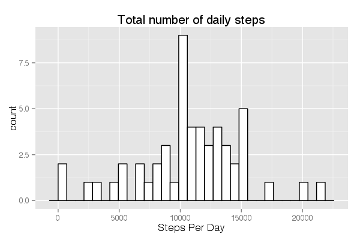
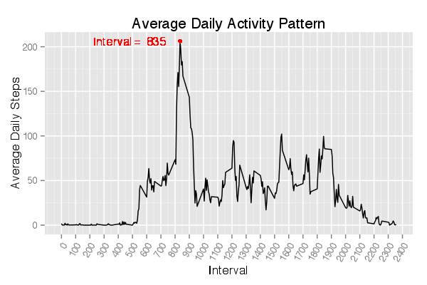
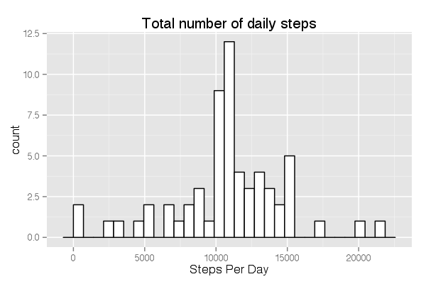
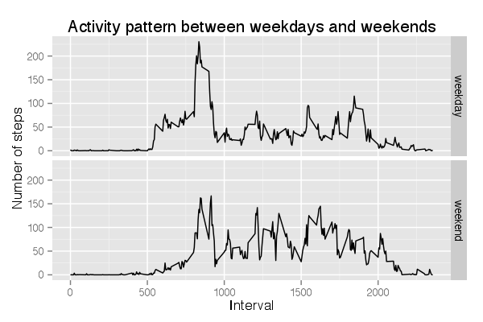

Reproducible Research: Peer Assessment 1
========================================================
## Loading and preprocessing the data


```r
activity = read.csv("activity.csv", header = T)
activity$Date <- as.Date(activity$date, "%Y-%m-%d")
```

# What is mean total number of steps taken per day?

```r
act.complete <- activity[complete.cases(activity),]
act.complete <- tbl_df(act.complete)
daily.steps.sum <- group_by(act.complete, Date)%.%
         summarize(steps.sum = sum(steps))
ggplot(data = daily.steps.sum, aes(x = steps.sum))+ 
        geom_histogram(fill = "white" , col = "black")+
        labs(x = "Steps Per Day", title = "Total number of daily steps")
```

 
A histogram of total nubmer of daily steps is plotted. The mean and median total number of steps taken each day are 1.0766 &times; 10<sup>4</sup> and 10765 respectively. 


# What is the average daily activity pattern?

```r
daily.steps.mean <- group_by(act.complete, interval)%.%
        summarize(steps.mean = mean(steps))

steps.max <- max(daily.steps.mean$steps.mean)
interval.max <- filter(daily.steps.mean, steps.mean == steps.max)$interval

ggplot(data = daily.steps.mean, aes(x = interval, y = steps.mean))+
        geom_line()+
        scale_x_continuous(breaks = seq(0,2400, by = 100))+
        geom_point(col = "red", aes(x = interval.max, y = steps.max))+
        geom_text(label = paste("Interval = ", interval.max), 
                  aes(x = interval.max, y = steps.max, hjust = 1.2), 
                  size = 4, col = "red")+
        labs(x = "Interval", 
             y = "Average Daily Steps",
             title = "Average Daily Activity Pattern")+
        theme(axis.text.x = element_text(angle = 60, hjust = 1))

#         geom_point(col = "red", aes(x = date.max, y = steps.max))+
#         labs(x = "Date", 
#              y = "Average Daily Steps",
#              title = "Average Daily Activity Pattern")
```

 

The average daily acitivty pattern is plotted on the average daily steps against the interval recorded. Shown as a red dot in the plot is the maximum average daily step (206.17), recorded in the 835th interval.


# Imputing missing values


```r
missing.value.N <- sum(is.na(activity$steps))
missing.value.percentage <- missing.value.N/dim(activity)[1]

# find which interval has NA values
date.with.NA <- unique(activity[is.na(activity$steps),]$Date)
act.with.NA <- filter(activity, Date %in% date.with.NA)

g <- group_by(act.complete, interval)%.% summarize(steps.mean = mean(steps))
steps.mean.byInterval <- g$steps.mean

act.with.NA$steps = steps.mean.byInterval
act.imputed <- rbind(act.complete, act.with.NA)
```


```r
daily.steps.sum.imp <- group_by(act.imputed, Date)%.%
        summarize(steps.sum = sum(steps))
ggplot(data = daily.steps.sum.imp, aes(x = steps.sum))+ 
        geom_histogram(fill = "white" , col = "black")+
        labs(x = "Steps Per Day", title = "Total number of daily steps")
```

```
## stat_bin: binwidth defaulted to range/30. Use 'binwidth = x' to adjust this.
```

 

The mean values at the each 5 min interval across the days was chosed to replace the missing values. After imputation, the adjusted mean and median total number of steps taken each day are 1.0766 &times; 10<sup>4</sup> and 1.0766 &times; 10<sup>4</sup> respectively. 

# Are there differnces in activity patterns between weekdays and weekends

```r
weekend <- weekdays(act.imputed$Date) %in% c("Saturday", "Sunday")
act.imputed$days = ifelse(weekend, "weekend", "weekday")
act.imputed.su <- group_by(act.imputed, days, interval)%.%
        summarize(steps.mean = mean(steps))
ggplot(data = act.imputed.su, aes(x = interval, y = steps.mean))+
        geom_line()+
        facet_grid(days ~ .)+
        labs(x = "Interval", y = "Number of steps",
             title = "Activity pattern between weekdays and weekends")
```

 

In both cases, the first activity peak occurs approximately before the 1000th interval. When compared to that on weekdays, the activity pattern on weekends is more evenly distubuted as indicated by average daily steps across all the interval recorded. 


